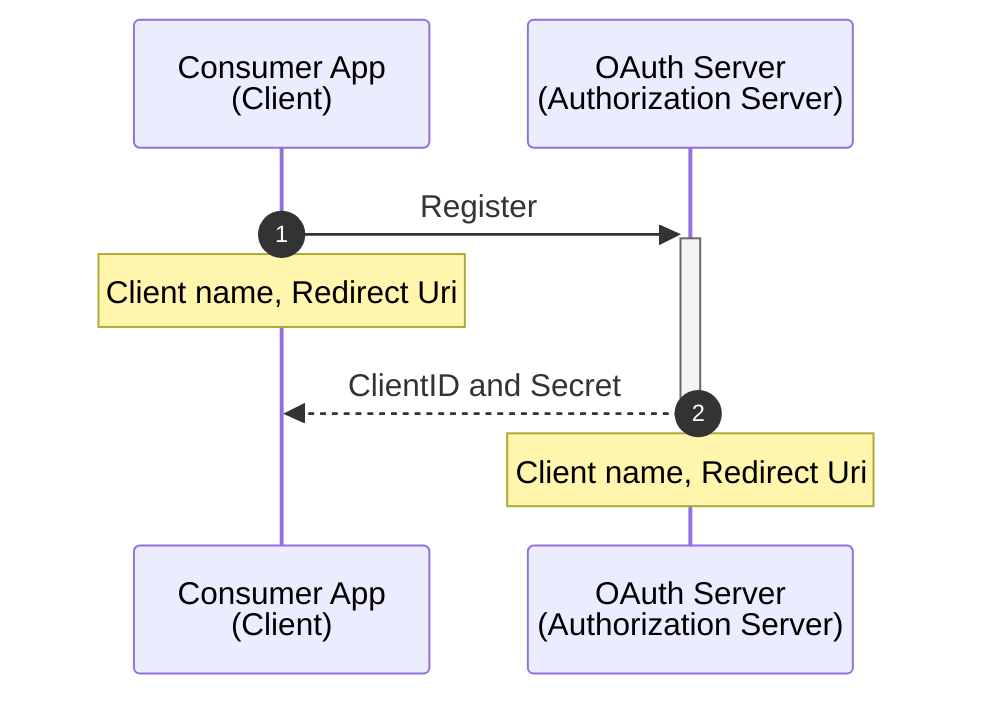
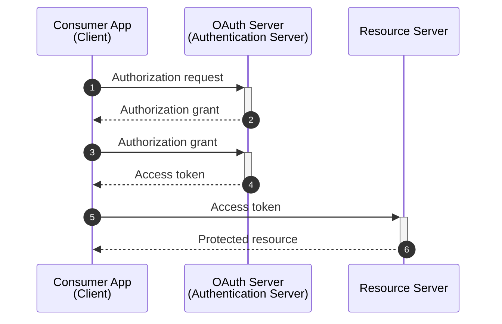

# OAuth

**Is an open standard for access delegation, commonly used as a way for internet users to grant websites or applications access to their information on other websites but without giving them the passwords**. This mechanism is used by companies to permit users to share information about their accounts with third-party applications or websites.

## Terminology

- **Resource Owner (User)**: owner of the identity and data.

- **Client**: the app that wants access data or perform actions on behalf of the resource owner (user)

- **Authorization Server**: is the app that knows the resource owner (user), it's where the resource owner has an account registered.

- **Resource Server**: is the app the client wants to use on behalf of the user.

  > Commonly the authorization and resource servers are the same entity, but sometimes they can even be from two different organizations.

- **Redirect Uri (Callback Url)**: Url where the authorization server will redirect the user back to after granting permission to the client.

  > This is also referred as _callback url_.

- **Response Type**: the type of information that the client expects to receive, the most common one is _code_.

  > This also know as authorization code.

- **Scope**: granular permissions that the client wants, i.e, access data or perform actions on behalf the user.

- **Consent**: TBC

- **Client ID**: TBC

  > Also known as _AppID_

- **Client Secret**: TBC

  > Also known as _App Secret_

- **Authorization Code**: TBC

- **Access Token**: TBC

## Registration

Before the client and servers start to exchange messages they need to establish a working relationship, this process will generate the _Client ID_ and _Secret_ for all future OAuth exchanges.

## Token grant flows

Also know as _grant types_:

### Authorization Code

Enables a _client_ application to obtain authorized access to protected resources like web APIs. The auth code flow requires a user-agent that supports redirection from the authorization server (the Microsoft identity platform) back to your application. For example, a web browser, desktop, or mobile application operated by a user to sign in to your app and access their data.

#### Proof Key for Code Exchange (PKCE)

Enhances the security of the OAuth 2.0 Authorization Code Grant flow. It was originally designed for mobile and public client applications that can't securely store a client secret, but it's now recommended for all client types.

Here's how _PKCE_ works:

1. **Code Challenge Generation**: The client generates a random string (code verifier) and then creates a hash of this string (code challenge).

2. **Authorization Request**: The client includes the code challenge in the authorization request to the authorization server.

3. **Authorization Response**: After the user authenticates and authorizes the client, the authorization server returns an authorization code to the client.

4. **Token Request**: The client sends the authorization code, along with the code verifier, to the token endpoint.

5. **Token Response**: The authorization server verifies the code challenge with the code verifier. If they match, it issues the access token.

### Client Credentials

> Sometimes called _two-legged OAuth_

Permits a web service (confidential client) to use its own credentials, instead of impersonating a user, to authenticate when calling another web service. Can be used to access web-hosted resources by using the identity of an application. This type is commonly used for server-to-server interactions that must run in the background, without immediate interaction with a user, and is often referred to as _daemons_ or _service accounts_.

### Refresh Token

This grant type allows clients to obtain new access tokens using refresh tokens without involving the user again. It is typically used in combination with other grant types (e.g., [authorization code](#authorization-code) grant) to extend the session without user re-authentication.

### Device Authorization Grant

Allows users to sign in to input-constrained devices such as a smart TV, IoT device, or a printer. To enable this flow, the device has the user visit a webpage in a browser on another device to sign in. Once the user signs in, the device is able to get access tokens and refresh tokens as needed.

### Implicit flow (legacy)

> **Do not use the implicit grant flow!**. In most scenarios, more secure alternatives are available and recommended. Certain configurations of this flow requires a very high degree of trust in the application, and carries risks that are not present in other flows. You should only use this flow when other more secure flows aren't viable.

The defining characteristic of the implicit grant is that tokens (ID tokens or access tokens) are returned directly from the `/authorize` endpoint instead of the `/token` endpoint. This is often used as part of the [authorization code](#authorization-code) flow, in what is called the _hybrid flow_ - retrieving the ID token on the `/authorize` request along with an authorization code.

### Resource Owner Password Credentials (ROPC)

> **Do not use the ROPC flow!**; it's incompatible with multifactor authentication (MFA). In most scenarios, more secure alternatives are available and recommended. This flow requires a very high degree of trust in the application, and carries risks that aren't present in other flows. You should only use this flow when more secure flows aren't viable.

> Sometimes called password grant

Allows an application to sign in the user by directly handling their password. This article describes how to program directly against the protocol in your application.

## More Information

- [OAuth 2.0](https://oauth.net/2/)
- [OAuth Playground](https://www.oauth.com/playground/)
- [Token grant flows - Microsoft Docs](https://learn.microsoft.com/en-us/entra/identity-platform/v2-oauth2-auth-code-flow)
- [OAuth 2.0 access tokens explained](https://www.youtube.com/watch?v=BNEoKexlmA4)
