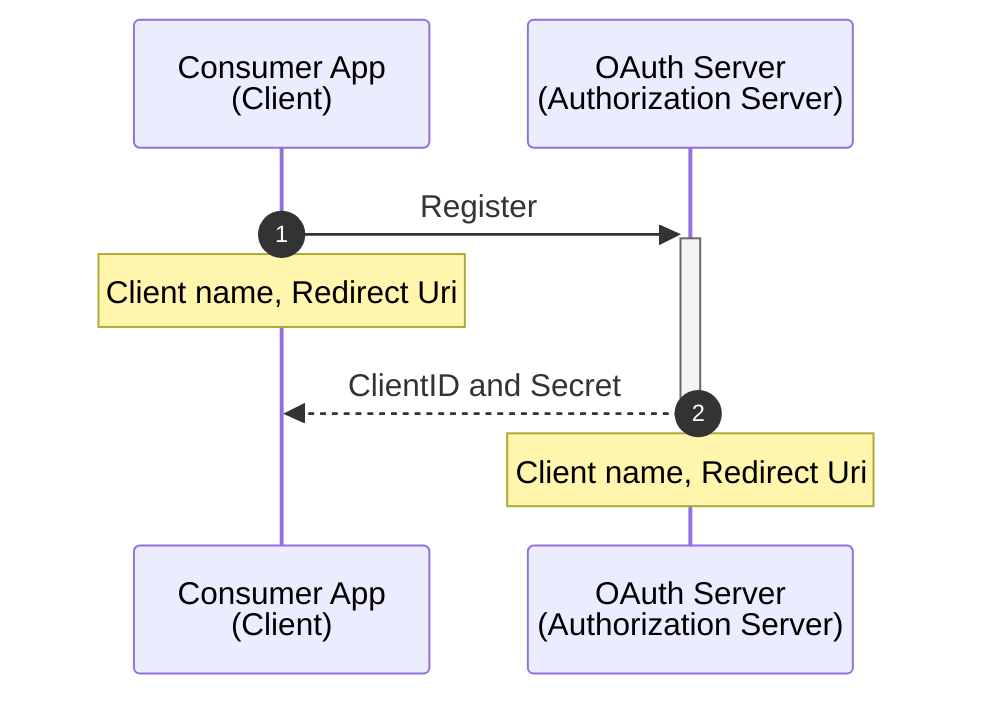
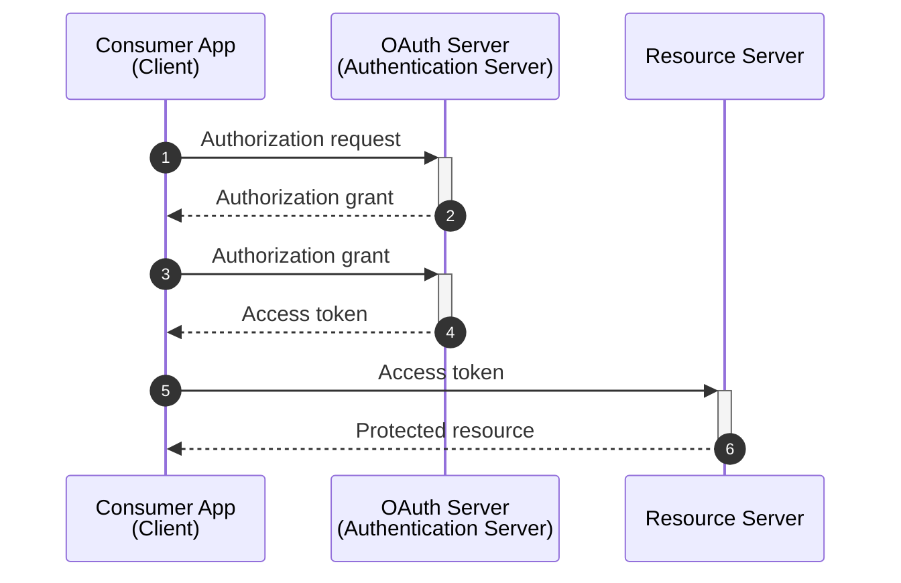

# OAuth

**Is an open standard for access delegation, commonly used as a way for internet users to grant websites or applications access to their information on other websites but without giving them the passwords**. This mechanism is used by companies to permit users to share information about their accounts with third-party applications or websites.

## Terminology

- **Resource Owner (User)**: owner of the identity and data.

- **Client**: the app that wants access data or perform actions on behalf of the resource owner (user)

- **Authorization Server**: is the app that knows the resource owner (user), it's where the resource owner has an account registered.

- **Resource Server**: is the app the client wants to use on behalf of the user.

  > Commonly the authorization and resource servers are the same entity, but sometimes they can even be from two different organizations.

- **Redirect Uri (Callback Url)**: Url where the authorization server will redirect the user back to after granting permission to the client.

  > This is also referred as _callback url_.

- **Response Type**: the type of information that the client expects to receive, the most common one is _code_.

  > This also know as authorization code.

- **Scope**: granular permissions that the client wants, i.e, access data or perform actions on behalf the user.

- **Consent**: TBC

- **Client ID**: TBC

  > Also known as _AppID_

- **Client Secret**: TBC

  > Also known as _App Secret_

- **Authorization Code**: TBC

- **Access Token**: TBC

## Registration

Before the client and servers start to exchange messages they need to establish a working relationship, this process will generate the _Client ID_ and _Secret_ for all future OAuth exchanges.

## Token grant flows

Also know as _grant types_:

- Authorization Code
- Proof Key for Code Exchange (PKCE)
- Client Credentials
- Device Code
- Refresh Token
- Implicit flow (legacy)
- Password grant (legacy)

## More Information

- [OAuth 2.0](https://oauth.net/2/)
- [Token grant flows - Microsoft Docs](https://learn.microsoft.com/en-us/entra/identity-platform/v2-oauth2-auth-code-flow)
- [OAuth 2.0 access tokens explained](https://www.youtube.com/watch?v=BNEoKexlmA4)
