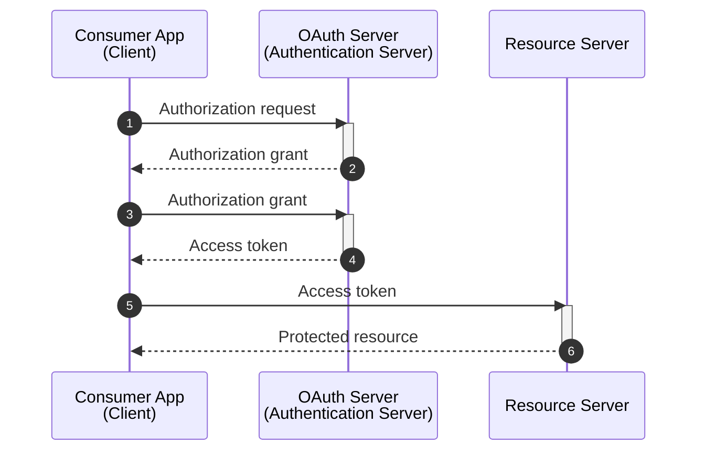
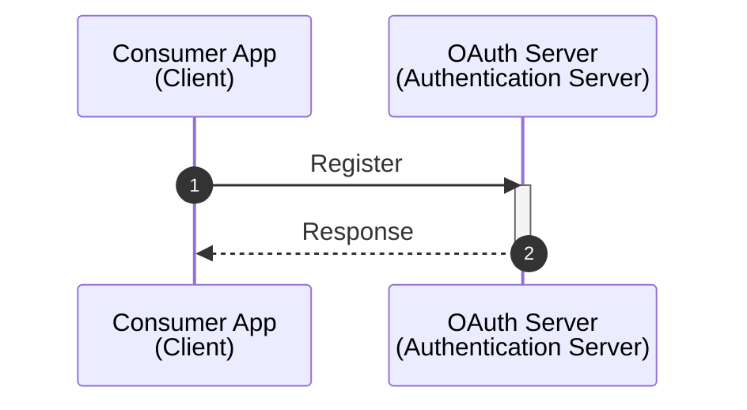

# OAuth

Is an open standard for access delegation, commonly used as a way for internet users to grant websites or applications access to their information on other websites but without giving them the passwords. This mechanism is used by companies to permit users to share information about their accounts with third-party applications or websites.

## Grant Types

- Authorization Code
- Proof Key for Code Exchange (PKCE)
- Client Credentials
- Device Code
- Refresh Token
- Implicit flow (legacy)
- Password grant (legacy)

## Registration

- Resource owner (user)
- Scope: granular permissions
- Response type: authorization code

## More Information

- [OAuth 2.0](https://oauth.net/2/)
